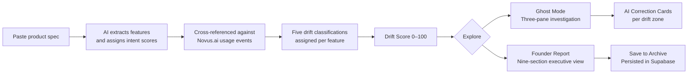
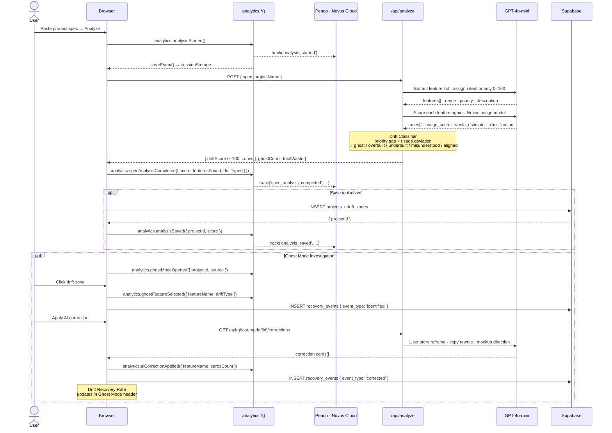

```mermaid
graph TB
    subgraph BROWSER["  BROWSER — Client-Side React  "]
        PG_ANALYZE["Analyze  /analyze\nSpec input · Score display · Save flow"]
        PG_GHOST["Ghost Mode  /ghost/[id]  /ghost/session\nThree-pane investigation · AI corrections"]
        PG_DASH["Dashboard  /dashboard\nArchive · Product Health Score"]
        PG_REPORT["Founder Report  /report/[id]\nNine-section executive view"]
        LIVE_PANEL["Novus Live Signals Panel\nTop Ghost · Corrections · Recovery · Session stats"]
        SESSION[("sessionStorage\ndrift_novus_telemetry\nJSON event log")]
    end

    subgraph TELEMETRY["  ANALYTICS ABSTRACTION — lib/novus.ts  ·  lib/novus-session.ts  "]
        ABSTR["analytics.*( )\n13 strongly-typed event methods\nSingle call site — no direct Pendo in components"]
        STORE["storeEvent( )\nAppend TelemetryEvent to sessionStorage log"]
        AGG["aggregateSignals( )\nDerive Live Signals from log — 4 s poll"]
        RESET["resetTelemetry( )\nClear sessionStorage + pendo.clearSession( )"]
    end

    PENDO_SDK["Pendo SDK\nwindow.pendo.track( )\nnext/script · strategy afterInteractive\ngraceful no-op when API key absent"]

    subgraph API_LAYER["  NEXT.JS 14 APP ROUTER — API Routes  ·  Node.js Runtime  "]
        API1["/api/analyze\nParse spec  →  GPT feature extraction\n→  usage scoring  →  drift classification  →  Drift Score"]
        API2["/api/health-score\nRecovery Rate × 0.40  +  Alignment Index × 0.30\nFeature Adoption × 0.20  +  Report Activity × 0.10\nReturns null when analyses = 0"]
        API3["/api/recovery\nSELECT recovery_events WHERE drift_type = ghost\ncorrected ÷ identified × 100  ·  per-project or global"]
        API4["/api/ghost-mode\nFetch drift_zones  ·  build context\nProxy AI correction card generation"]
    end

    subgraph COMPUTE["  COMPUTE — Server-Side Libraries  "]
        C1["Drift Classifier  ·  lib/analyze.ts\nghost · overbuilt · underbuilt · misunderstood · aligned\nthreshold: priority gap × usage deviation"]
        C2["computeHealthScore( )  ·  lib/health-score.ts\nWeighted composite  ·  trend: Improving / Declining\nnull guard — no phantom scores"]
        C3["calculateFounderAlignment( )  ·  lib/founder-alignment.ts\nRegret Index  ·  Alignment Index\ninputs: driftScore · ghostCount · overbuiltCount · concentrationScore"]
        C4["buildRealityMap( )  ·  lib/reality-map.ts\nIntent priority rank vs Novus usage rank\noutputs: concentrationScore · reallocationList"]
    end

    subgraph DB["  SUPABASE — PostgreSQL  ·  createAdminClient( )  ·  SERVICE_ROLE_KEY only  "]
        T1[("projects\nid  ·  name  ·  drift_score  ·  spec_source  ·  spec_text  ·  created_at")]
        T2[("drift_zones\nproject_id  ·  name  ·  drift_type  ·  intended_priority\nactual_usage_score  ·  waste_estimate  ·  description")]
        T3[("recovery_events\nproject_id  ·  feature_name  ·  event_type  ·  drift_type  ·  created_at")]
    end

    subgraph EXT["  EXTERNAL SERVICES  "]
        OR["OpenRouter  →  GPT-4o-mini\nSpec parsing  ·  Feature intent scoring\nAI correction card generation"]
        NC["Novus.ai  +  Pendo Cloud\nEvent stream  ·  Funnels  ·  Heatmaps\nRetention  ·  NPS  ·  Segments"]
    end

    PG_ANALYZE & PG_GHOST & PG_DASH & PG_REPORT -->|"user action  →  analytics.*()"| ABSTR
    ABSTR --> STORE & PENDO_SDK
    STORE <-->|"read / write  JSON"| SESSION
    SESSION -.->|"4 s interval"| AGG
    AGG -->|"live signal data"| LIVE_PANEL
    PENDO_SDK -->|"HTTPS  ·  event + properties"| NC

    PG_ANALYZE -->|"POST  { spec, projectName }"| API1
    PG_DASH -->|"GET /api/health-score"| API2
    PG_DASH & PG_REPORT -->|"GET /api/recovery?project_id"| API3
    PG_GHOST -->|"GET /api/ghost-mode/[id]"| API4

    API1 & API4 -->|"structured prompt"| OR
    API1 --> C1
    API2 --> C2
    C2 --> C3 & C4

    API1 -->|"INSERT"| T1 & T2
    PG_GHOST -->|"INSERT recovery_events"| T3
    API2 & API3 & API4 -->|"SELECT"| T1 & T2 & T3
```

<h1 align="center">DRIFT</h1>

<div align="center">

<h3 align="center">Product Intelligence Command Center</h3>

*Find the gap between what you shipped and what users actually adopted.*

[](https://nextjs.org)
[](https://www.typescriptlang.org)
[](https://tailwindcss.com)
[](https://supabase.com)
[](https://pendo.io)
[](https://novus.ai)
[](LICENSE)

</div>

---

<h2 align="center">What is DRIFT?</h2>

DRIFT is a **product intelligence tool** that compares your original product specification against real user behavior data from [Novus.ai](https://novus.ai) — powered by [Pendo](https://pendo.io) — and produces a single scored output: the **Drift Score**.

**Input:** A plain-text product spec, PRD, or feature list.
**Output:** Every feature classified, scored, and prioritized — with AI correction cards and engineering waste estimates.

> You built what you planned. Users adopted something else entirely.

---

<h2 align="center">The Problem</h2>

Product teams have analytics. They don't have **intent-aware** analytics.

Standard tools answer: *what are users doing?*
DRIFT answers: *where did users diverge from what you intended — and by how much?*

The gap between those two questions is where product debt accumulates, roadmaps misfire, and engineering spend disappears into features nobody uses.

---

<h2 align="center">How It Works</h2>



---

<h2 align="center">System Architecture</h2>

<h3 align="center">Full-Stack Component Map</h3>



<h3 align="center">Drift Score Pipeline</h3>



---

<h2 align="center">Drift Classifications</h2>

Every feature receives one of five classifications based on the gap between **intended priority** and **actual usage score** from Novus:

| Classification | Signal | Interpretation |
|---|---|---|
| **Ghost** | High priority · 0 usage | Built with effort. Never adopted. Engineering spend with zero return. |
| **Overbuilt** | High priority · Low usage | Over-invested. Users engage at a fraction of the expected rate. |
| **Underbuilt** | Low priority · High usage | Users seek it out. Your roadmap ignores it. Untapped growth vector. |
| **Misunderstood** | Any priority · Unexpected usage | Users engage, but not as the spec intended. Intent and behavior diverged. |
| **Aligned** | Priority ≈ Usage | Spec intent matches actual user behavior. Product-market fit signal. |

---

<h2 align="center">Core Features</h2>

| Feature | Description |
|---|---|
| **Drift Score Engine** | Weighted 0–100 signal computed from the gap between spec priority and Novus usage data. Below 50 = critical. 50–79 = drifting. 80+ = healthy. |
| **Ghost Mode** | Three-pane command center: Product Intent · Drift Analysis · Live Novus Event Feed. Click any zone to trigger an AI correction panel. |
| **Founder Report** | Nine-section executive dashboard covering Reality Map, Top Risks, Roadmap Reallocation, Feature Lifecycle, Engineering Waste, and AI Recommendations. |
| **Product Health Score** | Composite 0–100 metric weighted across four Novus-backed signals with live trend direction (↑ Improving / ↓ Declining). |
| **Drift Recovery Rate** | Live telemetry metric tracking ghost feature correction progress — powered by Pendo event data. |
| **Novus Live Signals** | Real-time panel in Ghost Mode aggregating Pendo events: top ghost zone, most-corrected feature, analysis count, and session activity. |
| **Product Reality Map** | Side-by-side view of Intended Product vs Actual Product, sorted by spec priority vs Novus usage rank. |
| **Roadmap Reallocation** | Invest / Improve / Remove recommendations derived from usage data and drift classifications. |
| **Engineering Waste Calculator** | Ghost and overbuilt features converted to sprint cost: sprints × team size × daily rate. |
| **AI Correction Cards** | GPT-4o-mini generates a user story reframe, copy rewrite, and mockup direction per drift zone. |
| **Founder Alignment Meter** | Arc meter displaying the Regret Index (0–100) and Alignment Index derived from drift score, ghost count, and Novus usage concentration. |
| **Analysis Archive** | Persistent storage of all saved analyses with scores, dates, ghost count, estimated waste, and Ghost Mode / Report quick-access. |
| **Session-First Flow** | All exploration — Ghost Mode, Founder Report, AI corrections — works without saving. Save to the archive only when ready. |

---

<h2 align="center">Novus.ai + Pendo Integration</h2>

DRIFT uses [Novus.ai](https://novus.ai) as its analytics backbone with [Pendo](https://pendo.io) as the underlying event tracking engine. Every user interaction with a drift zone, analysis, or report is captured and surfaced as a live signal.

<h3 align="center">Architecture</h3>

All analytics calls route through a single abstraction layer. No component interacts with Pendo directly.

```
User action
  → analytics abstraction layer
      → Pendo SDK (cloud forwarding to Novus.ai)
      → sessionStorage event log (local live panels — no API key required)
```

The session store enables Ghost Mode Live Signals, Drift Recovery Rate, and Product Health Score panels to display real telemetry without a Pendo Data API key.

<h3 align="center">Tracked Events</h3>

| Event | Properties | Fired When |
|---|---|---|
| `analysis_started` | — | Analyze button clicked |
| `spec_analysis_completed` | `score` · `featuresFound` · `driftTypes[]` | Successful analysis returned |
| `spec_pasted` | — | Spec textarea paste |
| `demo_spec_loaded` | `demoProjectName` · `specLength` · `source: demo` | Demo spec loaded |
| `ghost_mode_opened` | `projectId` · `source` | Ghost Mode opened |
| `ghost_feature_selected` | `featureName` · `driftType` | Drift zone clicked |
| `ai_correction_applied` | `featureName` · `driftType` · `cardsCount` | Correction cards loaded |
| `report_viewed` | `projectId` · `score` | Saved report opened |
| `report_generated` | `score` · `featuresFound` | Session report computed |
| `report_exported` | `projectName` · `score` | Export as Markdown clicked |
| `analysis_saved` | `projectId` · `score` | Analysis saved to dashboard |
| `archive_opened` | — | Dashboard navigated to |
| `project_deleted` | `projectId` · `projectName` · `driftScore` · `specSource` | Analysis deleted |

All 13 events originate exclusively from real user interactions. Zero auto-fire on load. Zero fabricated values.

<h3 align="center">Novus Live Signals Panel</h3>

Displayed in Ghost Mode's right sidebar. Powered entirely by the local sessionStorage event log — zero external API calls required for display.

| Signal | Source Event | Display |
|---|---|---|
| Top Ghost Zone | `ghost_feature_selected` | Feature name · selection count |
| Most Corrected Feature | `ai_correction_applied` | Feature name · correction count |
| Most Viewed Report | `report_viewed` | Project ID · view count |
| Total Analyses | `spec_analysis_completed` | Session count |
| Ghost Mode Opens | `ghost_mode_opened` | Session count |
| Reports Generated | `report_viewed` | Session count |

Shows **"Waiting for Novus telemetry…"** until the first real interaction. No fabricated values.

<h3 align="center">Pendo SDK Initialization</h3>

Pendo loads via `next/script` with `strategy="afterInteractive"` — non-blocking, after hydration. Gracefully disabled when `NEXT_PUBLIC_NOVUS_API_KEY` is unset: a console warning is emitted, and all analytics calls continue writing to sessionStorage. No feature is gated behind the Pendo key.

---

<h2 align="center">Product Health Score</h2>

A composite metric surfacing overall product health across four Pendo-backed signals.

| Component | Weight | Data Source | Definition |
|---|---|---|---|
| **Recovery Rate** | 40% | `recovery_events` | Corrected ghosts ÷ identified ghosts × 100 |
| **Alignment Index** | 30% | Founder alignment calculation | Drift score adjusted for ghost count, overbuilt count, and usage concentration |
| **Feature Adoption** | 20% | `drift_zones.actual_usage_score` | Mean Novus usage score across all features |
| **Report Activity** | 10% | Correction event count | Normalized correction activity |

**Trend direction:**

| Condition | Trend |
|---|---|
| Active corrections in progress | ↑ Improving |
| Ghosts identified, none corrected | ↓ Declining |
| No recovery data, score ≥ 50 | ↑ Improving |
| No recovery data, score < 50 | ↓ Declining |

Returns `null` when no analyses exist — the dashboard shows a no-data state rather than a misleading score.

Displayed in: Dashboard hero · Founder Report · Ghost Mode header.

---

<h2 align="center">Drift Recovery Rate</h2>

Tracks how actively a team is correcting identified ghost features, using Pendo event data as the source.

**Formula:** `(unique corrected ghost features ÷ unique identified ghost features) × 100`

| Term | Definition |
|---|---|
| **Identified** | Ghost features clicked in Ghost Mode — logged as `ghost_feature_selected` events |
| **Corrected** | Ghost features with correction cards applied — logged as `ai_correction_applied` events |
| **Deduplication** | A feature corrected multiple times counts as one |

| Rate | Signal |
|---|---|
| > 60% | Most identified ghosts have corrections in progress |
| 25–60% | Partial recovery underway |
| < 25% | Most ghosts remain uncorrected |

Available in three scopes: session (Ghost Mode, live), per-project (Founder Report), and global (Dashboard archive).

---

<h2 align="center">Ghost Mode</h2>

The primary investigation interface. Three-pane layout:

| Pane | Content | Width |
|---|---|---|
| **Product Intent** | Spec viewer with drift zone highlights | 25% |
| **Drift Analysis** | Interactive drift zone grid — click any zone for AI corrections | 45% |
| **User Reality** | Novus event feed · Live Signals panel · Recovery Rate | 30% |

**Header metrics:** Drift Score · Ghost Features · Estimated Waste · Sprints Lost · Drift Recovery Rate · Product Health Score

Clicking a drift zone fires a `ghost_feature_selected` event to Pendo and logs an `identified` record for recovery tracking. Applying a correction fires `ai_correction_applied` and logs a `corrected` record — updating the Drift Recovery Rate in real time.

---

<h2 align="center">Tech Stack</h2>

| Layer | Technology | Role |
|---|---|---|
| Framework | Next.js 14 App Router | Server + client components, API routes, file routing |
| Language | TypeScript 5 | End-to-end type safety |
| Styling | Tailwind CSS 3 | Utility-first, command-center aesthetic |
| Animation | Framer Motion 12 | Score rings, panel transitions, staggered reveals |
| Database | Supabase (PostgreSQL) | Project, zone, and telemetry persistence |
| AI | OpenRouter → GPT-4o-mini | Correction card generation |
| Analytics | Novus.ai + Pendo SDK | Event tracking, live signals, recovery metrics |
| Icons | Lucide React | Consistent icon system |

---

<h2 align="center">Application Routes</h2>

| Route | Description |
|---|---|
| `/` | Landing page — system status, drift schema, entry points |
| `/analyze` | Paste spec → score → explore or save |
| `/ghost` | Demo Ghost Mode — TaskFlow Pro, all five drift types, no login required |
| `/ghost/[id]` | Ghost Mode for a saved analysis |
| `/ghost/session` | Ghost Mode for an unsaved analysis — state preserved across navigation |
| `/dashboard` | Analysis archive with health score, recovery rate, and delete |
| `/report/[id]` | Nine-section Founder Report for a saved analysis |
| `/report/session` | Founder Report for an unsaved analysis — save from inline banner |
| `/demo` | Demo metrics dashboard |

---

<h2 align="center">Demo — TaskFlow Pro</h2>

DRIFT ships with **TaskFlow Pro** — a pre-built demo covering all five drift types. No credentials or database setup required.

**Entry point:** `/ghost` or **View Demo** on the landing page.

<h3 align="center">Demo Data</h3>

| Feature | Intended Priority | Novus Usage Score | Classification | Signal |
|---|---|---|---|---|
| Dashboard | High | 0 / 100 | **Ghost** | Built as must-have. Never adopted. |
| Kanban Board | High | 10 / 100 | **Overbuilt** | Heavy investment, minimal engagement. |
| CSV Export | Medium | 60 / 100 | **Misunderstood** | High usage, not used as designed. |
| Dark Mode | Low | 0 / 100 | **Aligned** | Low priority, low usage — as expected. |
| Team Workspace | Low | 90 / 100 | **Underbuilt** | High demand, treated as an afterthought. |

**Drift Score 44 · Ghost Features 2 · Estimated Waste $80,000**

<h3 align="center">Recommended Path (5 minutes)</h3>

| Step | Route | What to observe |
|---|---|---|
| 1 | `/ghost` | Demo Ghost Mode — five drift zones, Live Signals panel. Click "Dashboard" zone → AI correction card |
| 2 | `/` → Analyze | Paste your own spec or PRD. Click Analyze |
| 3 | `/analyze` | Review drift score and zone breakdown. Click "View in Ghost Mode" |
| 4 | `/ghost/session` | Click a ghost zone — watch Drift Recovery Rate update in the header |
| 5 | `/report/session` | Founder Report — Reality Map, Engineering Waste, Roadmap Reallocation |
| 6 | Save → `/dashboard` | Archive + Product Health Score |

---

<h2 align="center">Getting Started</h2>

<h3 align="center">Prerequisites</h3>

| Requirement | Purpose |
|---|---|
| Node.js 18+ | Runtime |
| Supabase project | Persistence for analyses, zones, and recovery events |
| OpenRouter API key | GPT-4o-mini for AI correction cards |
| Novus.ai / Pendo key | event tracking |

<h3 align="center">Setup</h3>

```bash
git clone https://github.com/RobertSamuel-tech/Drift-.git
cd Drift-
npm install
```

Create `.env.local`:

```env
NEXT_PUBLIC_SUPABASE_URL=https://your-project.supabase.co
NEXT_PUBLIC_SUPABASE_ANON_KEY=your_anon_key
SUPABASE_SERVICE_ROLE_KEY=your_service_role_key

OPENROUTER_API_KEY=your_openrouter_api_key
OPENROUTER_MODEL=openai/gpt-4o-mini

NEXT_PUBLIC_NOVUS_API_KEY=your_pendo_snippet_key
NEXT_PUBLIC_NOVUS_PROJECT_ID=your_novus_project_id
NOVUS_API_KEY=your_pendo_snippet_key
```

> **Pendo snippet key** — found in Pendo under Settings → Subscription → App Details.
> **Without Pendo:** all analytics calls write to sessionStorage. Ghost Mode, Live Signals, Drift Recovery Rate, and Product Health Score all function normally.

```bash
npm run dev      # http://localhost:3000
```

Database migration files are in `supabase/` — run `schema.sql` followed by the numbered migrations in the `supabase/migrations/` folder in your Supabase SQL editor.

---
DRIFT is the first platform designed to measure Product Drift - the gap between what teams intended to build and what users actually value.
---
<h2 align="center">License</h2>

MIT © 2026 RobertSamuel-tech — see [LICENSE](LICENSE)
