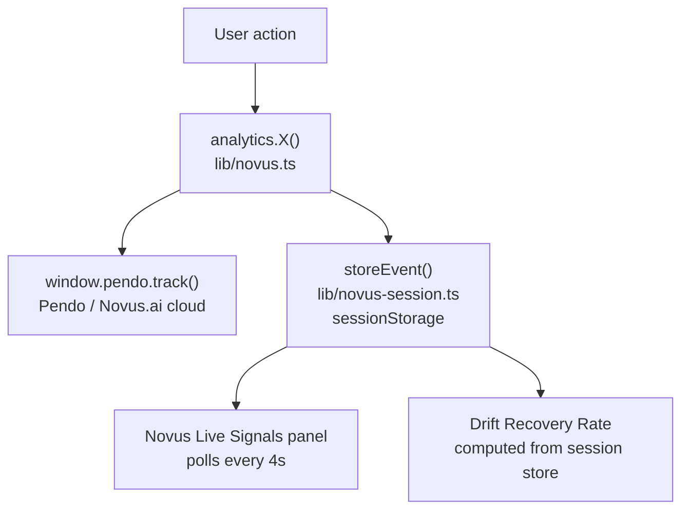
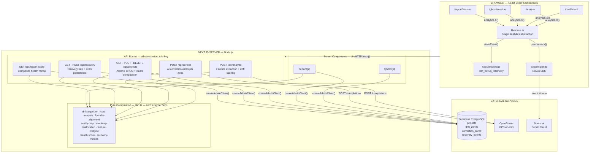
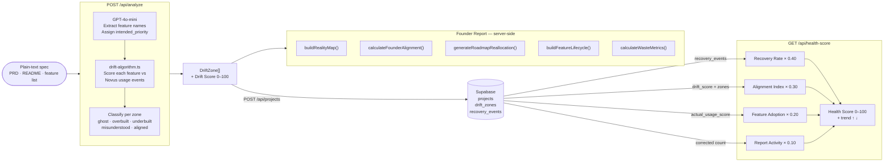
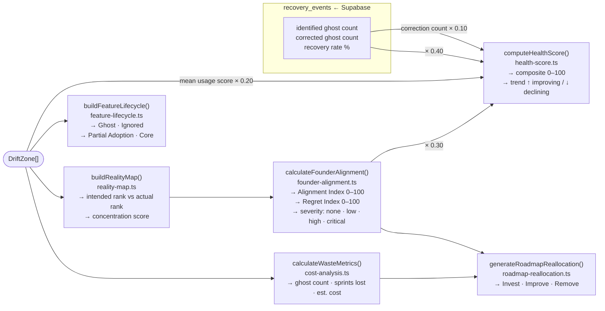

# DRIFT

<div align="center">

### Product Intelligence Command Center

*Find the gap between what you shipped and what users actually adopted.*

[](https://nextjs.org)
[](https://www.typescriptlang.org)
[](https://tailwindcss.com)
[](https://supabase.com)
[](https://pendo.io)
[](https://novus.ai)
[](LICENSE)

</div>

---

## What is DRIFT?

DRIFT is a **product intelligence tool** that compares your original product specification against real user behavior data from [Novus.ai](https://novus.ai) (powered by [Pendo](https://pendo.io)) and produces a single scored output: the **Drift Score**.

**Input:** A plain-text product spec, PRD, or feature list.
**Output:** Every feature classified, scored, and prioritized — with AI correction cards and engineering waste estimates.

> You built what you planned. Users adopted something else entirely.

---

## The Problem

Product teams have analytics. They don't have **intent-aware** analytics.

Standard tools answer: *what are users doing?*
DRIFT answers: *where did users diverge from what you intended, and by how much?*

The gap between those two questions is where product debt accumulates, roadmaps misfire, and engineering spend disappears into features nobody uses.

---

## How It Works

```mermaid
flowchart LR
    A[Paste product spec] --> B[/api/analyze]
    B --> C[GPT-4o-mini extracts features\nand assigns intent scores]
    C --> D[Cross-referenced against\nNovus.ai usage events]
    D --> E[Five drift classifications\nassigned per feature]
    E --> F[Drift Score 0–100]
    F --> G{Explore}
    G --> H[Ghost Mode\nThree-pane investigation]
    G --> I[Founder Report\nNine-section executive view]
    H --> J[AI Correction Cards\nper drift zone]
    I --> K[Save to Archive\nPersisted in Supabase]
```

---

## Drift Classifications

Every feature in the spec receives one of five classifications based on the gap between **intended priority** and **actual usage score**:

| Classification | Signal | Interpretation |
|---|---|---|
| **Ghost** | High priority · 0 usage | Built with effort. Never adopted. Engineering spend with zero return. |
| **Overbuilt** | High priority · Low usage | Over-invested. Users engage at a fraction of the expected rate. |
| **Underbuilt** | Low priority · High usage | Users seek it out. Your roadmap ignores it. Untapped growth vector. |
| **Misunderstood** | Any priority · Unexpected usage | Users engage, but not as the spec intended. Intent and behavior diverged. |
| **Aligned** | Priority ≈ Usage | Spec intent matches actual user behavior. Product-market fit signal. |

---

## Feature Matrix

| Feature | Description |
|---|---|
| **Drift Score Engine** | Weighted 0–100 signal computed from the gap between spec priority and Novus usage data. Below 50 = critical. 50–79 = drifting. 80+ = healthy. |
| **Ghost Mode** | Three-pane command center: Product Intent · Drift Analysis · Live Novus Event Feed. Click any zone to trigger an AI correction panel. |
| **Founder Report** | Nine-section executive dashboard covering Reality Map, Top Risks, Roadmap Reallocation, Feature Lifecycle, Engineering Waste, and AI Recommendations. |
| **Product Health Score** | Composite 0–100 metric weighted across four signals with trend direction (↑ / ↓). See [Product Health Score](#product-health-score). |
| **Drift Recovery Rate** | Live telemetry metric tracking ghost feature correction progress. See [Drift Recovery Rate](#drift-recovery-rate). |
| **Product Reality Map** | Side-by-side view of Intended Product vs Actual Product, sorted by spec priority vs usage rank. |
| **Roadmap Reallocation** | Invest / Improve / Remove recommendations derived from usage data and drift classifications. |
| **Engineering Waste Calculator** | Ghost and overbuilt features converted to sprint cost: `sprints × team size × daily rate`. |
| **AI Correction Cards** | GPT-4o-mini via OpenRouter. Each drift zone produces a user story reframe, copy rewrite, and mockup direction. |
| **Founder Alignment Meter** | SVG arc meter displaying the Regret Index (0–100) and Alignment Index derived from drift score, ghost count, and usage concentration. |
| **Analysis Archive** | Persistent storage of all saved analyses with scores, dates, ghost count, estimated waste, Ghost Mode and Report quick-access, and per-entry deletion. |
| **Session-First Flow** | All exploration — Ghost Mode, Founder Report, AI corrections — works without saving. State is preserved across navigation. Save to the archive only when ready. |

---

## Product Health Score

A single composite metric that surfaces the overall health of a product across four telemetry signals.

**Formula:**

```
Health Score = (Recovery Rate × 0.40)
             + (Alignment Index × 0.30)
             + (Feature Adoption × 0.20)
             + (Report Activity × 0.10)
```

| Component | Weight | Source | Definition |
|---|---|---|---|
| **Recovery Rate** | 40% | `recovery_events` table | Corrected ghosts ÷ identified ghosts × 100 |
| **Alignment Index** | 30% | `calculateFounderAlignment()` | Drift score adjusted for ghost count, overbuilt count, and usage concentration |
| **Feature Adoption** | 20% | `drift_zones.actual_usage_score` | Mean usage score across all features (including ghosts at 0) |
| **Report Activity** | 10% | `recovery_events` corrected count | Normalized correction event count (per-project: ×25 cap 100; global: ×10 cap 100) |

**Trend signal:**

| Condition | Trend |
|---|---|
| `correctedGhosts > 0` | ↑ Improving — active correction in progress |
| `identifiedGhosts > 0` and `correctedGhosts = 0` | ↓ Declining — drift identified, not addressed |
| No recovery data, `score ≥ 50` | ↑ Improving |
| No recovery data, `score < 50` | ↓ Declining |

Displayed in the Dashboard hero, Founder Report, and Ghost Mode header.
API: `GET /api/health-score` · `GET /api/health-score?project_id={uuid}`

---

## Drift Recovery Rate

Tracks how actively a team is correcting identified ghost features.

**Formula:** `(unique corrected ghost features ÷ unique identified ghost features) × 100`

| Term | Definition | Source |
|---|---|---|
| Identified | Unique feature names from `ghost_feature_selected` events with `driftType = ghost` | `recovery_events` table · session store |
| Corrected | Unique feature names from `ai_correction_applied` events with `driftType = ghost` | `recovery_events` table · session store |
| Deduplication | `Set<string>` — a feature corrected 5× counts as 1 | `lib/recovery-metrics.ts` |

| Rate | Color | Signal |
|---|---|---|
| > 60% | Green | Most identified ghosts have corrections in progress |
| 25–60% | Amber | Partial recovery |
| < 25% | Red | Most ghosts remain uncorrected |

Three data contexts: session-scoped (Ghost Mode, live), per-project (Founder Report), global (Dashboard archive).
API: `GET /api/recovery` · `GET /api/recovery?project_id={uuid}`

---

## Ghost Mode

The primary investigation interface. Accessed from the archive or directly after analysis.

```
┌──────────────────┬─────────────────────┬──────────────────────┐
│  Product Intent  │   Drift Analysis    │    User Reality      │
│  (25%)           │   (45%)             │    (30%)             │
│                  │                     │                      │
│  Spec viewer     │  Drift zone grid    │  Novus event feed    │
│  with zone       │  Click zone →       │                      │
│  highlights      │  AI correction      │  Novus Live Signals  │
│                  │  panel              │  panel               │
└──────────────────┴─────────────────────┴──────────────────────┘

Header: Drift Score · Ghost Features · Est. Waste · Sprints Lost
        · Drift Recovery Rate · Product Health Score
```

- Clicking a drift zone fires `ghost_feature_selected` to Pendo and logs an `identified` event to `recovery_events`
- Applying a correction fires `ai_correction_applied` and logs a `corrected` event
- The Novus Live Signals panel polls sessionStorage every 4 seconds — no API key required for display

---

## Novus.ai + Pendo Integration

DRIFT uses [Novus.ai](https://novus.ai) as its analytics backbone with [Pendo](https://pendo.io) as the underlying event tracking engine.

### Event Flow



All components call `analytics.X()` from `lib/novus.ts`. No component calls `pendo.track()` directly. The session store enables all live panels without a Pendo Data API key.

### SDK Initialization

Pendo loads via `next/script` with `strategy="afterInteractive"` in `app/providers.tsx`, which wraps the application through `app/layout.tsx`.

```
app/layout.tsx
  └── <Providers>
        └── <Script src="https://cdn.pendo.io/agent/static/{key}/pendo.js"
                    strategy="afterInteractive"
                    onLoad={() => pendo.initialize({ visitor: { id: 'anonymous' }, account: { id: ACCOUNT } })} />
```

Pendo is gracefully disabled when `NEXT_PUBLIC_NOVUS_API_KEY` is unset — a console warning is shown and all `analytics.X()` calls become no-ops for the Pendo path while still writing to sessionStorage.

### Tracked Events

| Event | Properties | Fired When |
|---|---|---|
| `analysis_started` | — | Analyze button clicked |
| `analysis_completed` | `score` · `featuresFound` · `driftTypes[]` | API success in `/analyze` — fresh analysis only |
| `spec_pasted` | — | Spec textarea `onPaste` |
| `ghost_mode_opened` | `projectId` · `source` | Ghost Mode opened from archive, report, or analyze page |
| `ghost_feature_selected` | `featureName` · `driftType` | Drift zone clicked in Ghost Mode |
| `ai_correction_applied` | `featureName` · `driftType` · `cardsCount` | Correction cards loaded from `/api/correct` |
| `report_viewed` | `projectId` · `score` | Saved report page mounts |
| `report_generated` | `score` · `featuresFound` | Session (unsaved) report computed |
| `report_exported` | `projectName` · `score` | Export as Markdown clicked |
| `analysis_saved` | `projectId` · `score` | Analysis saved to dashboard |
| `archive_opened` | — | User navigates to `/dashboard` |

### Novus Live Signals Panel

Displayed in Ghost Mode's right sidebar. Powered by sessionStorage — zero external API calls required for display.

| Signal | Source Event | Display |
|---|---|---|
| Top Ghost Zone | `ghost_feature_selected` (driftType=ghost) | Feature name · selection count |
| Most Corrected Feature | `ai_correction_applied` (driftType=ghost) | Feature name · correction count |
| Most Viewed Report | `report_viewed` | Project ID · view count |
| Total Analyses | `analysis_completed` | Session count |
| Ghost Mode Opens | `ghost_mode_opened` | Session count |
| Reports Generated | `report_viewed` | Session count — fires for both session and saved reports |

Shows **"Waiting for Novus telemetry…"** until the first real interaction. No fabricated values.

---

## System Architecture

### Full Stack



---

### Analysis Pipeline — Spec to Health Score



---

### Three-Tier Storage Model

```
┌──────────────────────────┬──────────────────────────┬──────────────────────────┐
│   EPHEMERAL              │   PERSISTENT             │   CLOUD                  │
│   sessionStorage         │   Supabase PostgreSQL    │   Novus.ai / Pendo       │
├──────────────────────────┼──────────────────────────┼──────────────────────────┤
│                          │                          │                          │
│  WRITE PATH              │  WRITE PATH              │  WRITE PATH              │
│  analytics.X()           │  POST /api/projects      │  window.pendo.track()    │
│  → storeEvent()          │  POST /api/recovery      │  via lib/novus.ts        │
│  synchronous             │  service_role key only   │  async, non-blocking     │
│                          │                          │                          │
│  READ PATH               │  READ PATH               │  READ PATH               │
│  aggregateSignals()      │  GET /api/projects       │  Novus.ai dashboard      │
│  NovusAnalyticsPanel     │  GET /api/recovery       │  (external)              │
│  polls every 4s          │  GET /api/health-score   │                          │
│                          │  Server Components       │                          │
│                          │  (RSC direct query)      │                          │
│                          │                          │                          │
│  STORES                  │  TABLES                  │  EVENTS                  │
│  analysis_completed      │  projects                │  All 11 analytics        │
│  ghost_mode_opened       │  drift_zones             │  events forwarded        │
│  ghost_feature_selected  │  correction_cards        │  from lib/novus.ts       │
│  ai_correction_applied   │  recovery_events         │                          │
│  report_viewed           │                          │                          │
│                          │                          │                          │
│  SCOPE                   │  SCOPE                   │  SCOPE                   │
│  Per browser tab         │  Cross-session           │  Cross-device            │
│  Cleared on demo reset   │  Permanent until deleted │  Permanent               │
│                          │                          │                          │
│  CONSUMERS               │  CONSUMERS               │  CONSUMERS               │
│  Novus Live Signals      │  Analysis Archive        │  Analytics dashboard     │
│  Drift Recovery Rate     │  Founder Report          │  Funnel analysis         │
│  Product Health Score    │  Product Health Score    │  Retention reports       │
│  (session variant)       │  Ghost Mode header       │                          │
└──────────────────────────┴──────────────────────────┴──────────────────────────┘
                 ↑                        ↑                        ↑
     Zero API key required       service_role enforced    Gracefully disabled
     Works offline              Client never holds key    when key unset
```

---

### Computation Graph — `DriftZone[]` → All Derived Metrics



---

### Security Boundary

```
Browser                    Next.js Server              Supabase
──────────────────────     ──────────────────────      ──────────────────────
NEXT_PUBLIC_* vars only    SUPABASE_SERVICE_ROLE_KEY   RLS enabled on all tables
                           never exposed to client      user_id nullable
No Supabase client         All DB writes server-side   service_role bypasses RLS
instantiated client-side   createAdminClient() only    for legitimate API writes

Client → API Route → DB    (never Client → DB)
```

### Data Layer

```
Supabase PostgreSQL
├── projects          — id · name · drift_score · spec_content · spec_source · last_analyzed
├── drift_zones       — project_id · feature_name · intended_priority · actual_usage_score · drift_type
├── correction_cards  — project_id · drift_zone_id · title · user_story · copy_rewrite · mockup_suggestion · priority
└── recovery_events   — project_id · feature_name · drift_type · event_type (identified | corrected)
```

All tables have Row Level Security enabled. `user_id` is nullable — the service role key used by all API routes bypasses RLS for writes. No client component holds a Supabase key.

### Computation Layer — Pure TypeScript, No External Dependencies

| Module | Function | Output |
|---|---|---|
| `lib/drift-algorithm.ts` | Feature extraction + drift scoring | Drift Score 0–100 · drift type per zone |
| `lib/cost-analysis.ts` | `calculateWasteMetrics()` | Sprint count · days wasted · estimated cost |
| `lib/founder-alignment.ts` | `calculateFounderAlignment()` | Alignment Index · Regret Index · severity |
| `lib/reality-map.ts` | `buildRealityMap()` | Intended vs actual feature ranking · concentration score |
| `lib/roadmap-reallocation.ts` | `generateRoadmapReallocation()` | Invest / Improve / Remove action lists |
| `lib/feature-lifecycle.ts` | `buildFeatureLifecycle()` | Ghost → Ignored → Partial Adoption → Core Product |
| `lib/recovery-metrics.ts` | `fetchProjectRecovery()` · `fetchGlobalRecovery()` | Drift Recovery Rate |
| `lib/health-score.ts` | `computeHealthScore()` | Product Health Score 0–100 + trend |

---

## Tech Stack

| Layer | Technology | Version | Role |
|---|---|---|---|
| Framework | Next.js App Router | 14 | Server + client components, API routes, file routing |
| Language | TypeScript | 5 | End-to-end type safety |
| Styling | Tailwind CSS | 3 | Utility-first, command-center aesthetic |
| Animation | Framer Motion | 12 | Score rings, panel transitions, staggered reveals |
| Database | Supabase (PostgreSQL) | — | Project, zone, and telemetry persistence |
| AI | OpenRouter → GPT-4o-mini | — | Correction card generation via `openai` SDK |
| Analytics | Novus.ai + Pendo SDK | — | Event tracking, live signals, recovery metrics |
| Icons | Lucide React | — | Consistent icon system |

---

## Application Routes

| Route | Render | Description |
|---|---|---|
| `/` | Client | Landing page — system status, drift schema, entry points |
| `/analyze` | Client | Paste spec → score → explore or save |
| `/ghost` | Server | Demo Ghost Mode — TaskFlow Pro, all five drift types, no login required |
| `/ghost/[id]` | Server + Client | Ghost Mode for a saved analysis |
| `/ghost/session` | Client | Ghost Mode for an unsaved analysis — back nav restores state |
| `/dashboard` | Client | Analysis archive with health score, recovery rate, and delete |
| `/report/[id]` | Server + Client | Nine-section Founder Report for a saved analysis |
| `/report/session` | Client | Founder Report for an unsaved analysis — save from banner |

---

## Database Schema

Run in your Supabase SQL editor in order:

```
supabase/schema.sql                         ← base tables (fresh project)
supabase/migrations/001_nullable_user_id.sql  ← makes user_id nullable
supabase/migrations/002_recovery_events.sql   ← adds recovery_events table
```

### Tables

**`projects`** — one row per saved analysis

| Column | Type | Notes |
|---|---|---|
| `id` | uuid | PK, auto-generated |
| `user_id` | uuid | Nullable FK → profiles |
| `name` | text | Display name |
| `drift_score` | integer | 0–100 |
| `spec_content` | text | Original PRD text |
| `spec_source` | text | `manual` · `github` · `demo` |
| `last_analyzed` | timestamptz | Set on save |

**`drift_zones`** — one row per feature per analysis

| Column | Type | Notes |
|---|---|---|
| `project_id` | uuid | FK → projects |
| `feature_name` | text | Extracted from spec |
| `intended_priority` | text | `high` · `medium` · `low` |
| `actual_usage_score` | integer | 0–100, from Novus data |
| `drift_type` | text | `ghost` · `overbuilt` · `underbuilt` · `misunderstood` · `aligned` |

**`recovery_events`** — one row per ghost feature interaction

| Column | Type | Notes |
|---|---|---|
| `project_id` | uuid | FK → projects |
| `feature_name` | text | Ghost feature name |
| `event_type` | text | `identified` · `corrected` |

---

## Getting Started

### Prerequisites

| Requirement | Purpose |
|---|---|
| Node.js 18+ | Runtime |
| Supabase project | Database for projects, drift zones, and recovery events |
| OpenRouter API key | GPT-4o-mini for AI correction cards |
| Novus.ai / Pendo key | Optional — analytics disabled gracefully without it |

### 1. Clone and Install

```bash
git clone https://github.com/RobertSamuel-tech/Drift-.git
cd Drift-
npm install
```

### 2. Environment Variables

Create `.env.local` in the project root:

```env
# Supabase
NEXT_PUBLIC_SUPABASE_URL=https://your-project.supabase.co
NEXT_PUBLIC_SUPABASE_ANON_KEY=your_anon_key
SUPABASE_SERVICE_ROLE_KEY=your_service_role_key

# OpenRouter (AI correction cards)
OPENROUTER_API_KEY=your_openrouter_api_key
OPENROUTER_MODEL=openai/gpt-4o-mini

# Novus.ai / Pendo (optional — app works without this)
NEXT_PUBLIC_NOVUS_API_KEY=your_pendo_snippet_key
NEXT_PUBLIC_NOVUS_PROJECT_ID=your_novus_project_id
NOVUS_API_KEY=your_pendo_snippet_key
```

> **Pendo snippet key** — found in Pendo under Settings → Subscription → App Details. Loads the client-side SDK from `https://cdn.pendo.io/agent/static/{key}/pendo.js`. A server-side Pendo Data API key is not required — live telemetry panels use sessionStorage aggregation.
>
> **Without Pendo:** All `analytics.X()` calls still write to sessionStorage. Ghost Mode, Live Signals, Drift Recovery Rate, and Product Health Score all function normally. Only Pendo cloud forwarding is skipped.

### 3. Database Setup

In your Supabase SQL Editor, run in order:

```sql
-- Step 1: base schema
-- paste contents of supabase/schema.sql

-- Step 2: make user_id nullable
-- paste contents of supabase/migrations/001_nullable_user_id.sql

-- Step 3: add recovery tracking
-- paste contents of supabase/migrations/002_recovery_events.sql
```

### 4. Run

```bash
npm run dev      # development server → http://localhost:3000
npm run build    # production build
npm run start    # production server
```

Verify environment at `http://localhost:3000/api/health` — returns which env vars are detected.

---

## Demo Flow

DRIFT ships with **TaskFlow Pro** — a pre-built demo covering all five drift types. No credentials or database setup required.

**Entry point:** `/ghost` or click **View Demo** on the landing page.

### TaskFlow Pro Demo Data

| Feature | Intended Priority | Usage Score | Classification | Signal |
|---|---|---|---|---|
| Dashboard | High | 0/100 | **Ghost** | Built as must-have. Never adopted. |
| Kanban Board | High | 10/100 | **Overbuilt** | Heavy investment, minimal engagement. |
| CSV Export | Medium | 60/100 | **Misunderstood** | High usage, not used as designed. |
| Dark Mode | Low | 0/100 | **Aligned** | Low priority, low usage — as expected. |
| Team Workspace | Low | 90/100 | **Underbuilt** | High demand, treated as an afterthought. |

**Demo stats: Drift Score 44 · Ghost Features 2 · Estimated Waste $80,000**

### Recommended Judge Path (5 minutes)

```
1. /ghost          → Open demo Ghost Mode
                     Observe: five drift zones, live signals panel
                     Click "Dashboard" zone → view AI correction card

2. /               → Landing page
                     Paste a real spec or PRD from your own product
                     Click Analyze

3. /analyze        → Review drift score and zone breakdown
                     Click "View in Ghost Mode"

4. /ghost/session  → Investigate the zones
                     Click a ghost zone → read the correction card
                     Watch Drift Recovery Rate update

5. /report/session → Open the Founder Report
                     Review Reality Map, Engineering Waste, Roadmap Reallocation

6. Save → /dashboard → Archive + Product Health Score
```

---

## License

MIT © 2026 RobertSamuel-tech — see [LICENSE](LICENSE)
